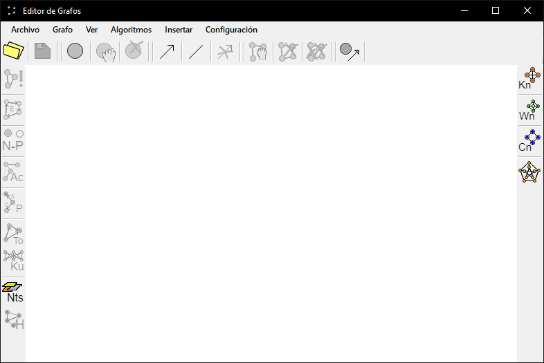
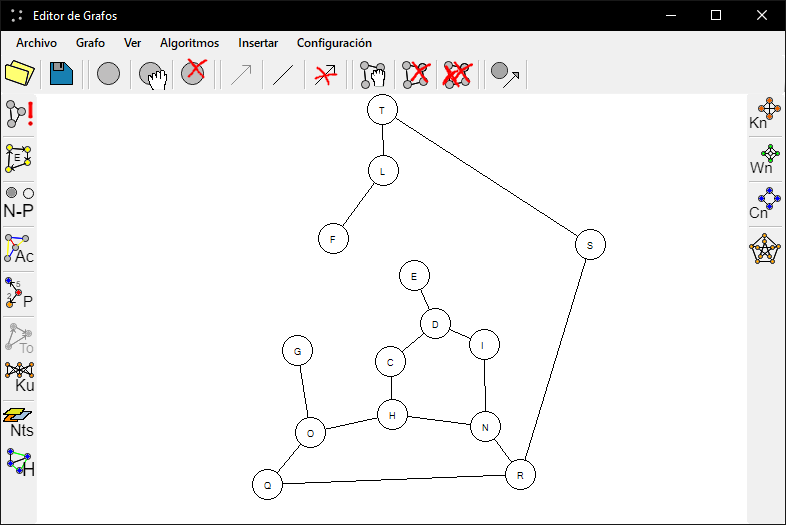

# Graph simulator

Graph theory simulator. Directed and undirected graphs can be built
and use some common algorithms to test and prove results.

## Algorithms

- Complement
- Euler
- N-Partita
- Kuratowsky
- Prim
- Colored Edges
- Topological classification
- Hamilton

## Features

- Insert KN, Wn, Cn and special graphs
- Save and load graphs
- Style graphs to your preference

Made in WinForms and C#, .net 4.6.1

## Screenshot

